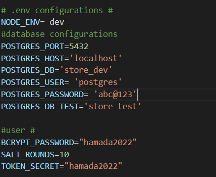
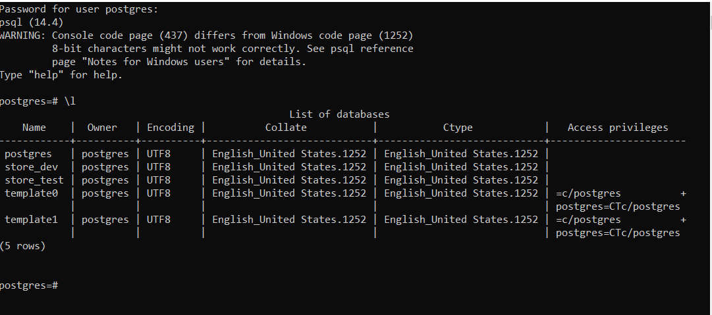
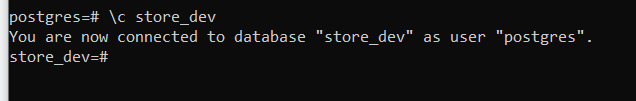
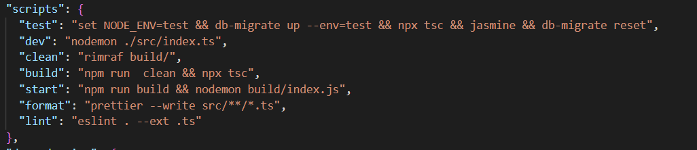
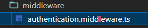
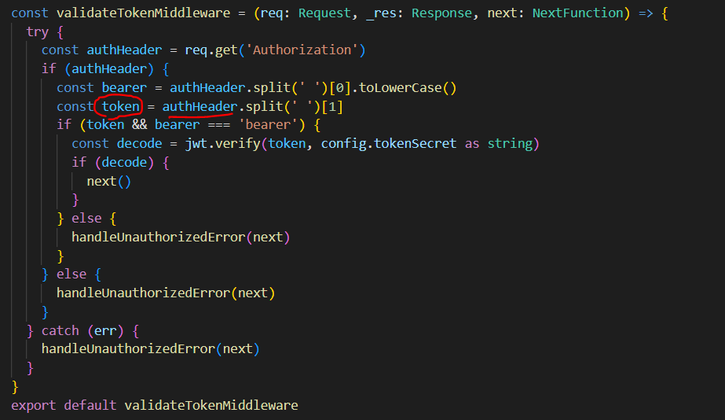

# Storefront Backend Project
This project is a demo for an online store backend. It has all the functionality required to create a backend for the store Like<br>
1- Creating,Reading,Updating and Deleting users, products and orders<br>
2- Authenticating registered users using authentication token.<br>

# Getting Started
**.Env Variables**



``` 
# .env configurations # 
NODE_ENV= dev
#database configurations
POSTGRES_PORT=5432
POSTGRES_HOST='localhost'
POSTGRES_DB='store_dev'
POSTGRES_USER= 'postgres'
POSTGRES_PASSWORD= 'abc@123'
POSTGRES_DB_TEST='store_test'

#user #
BCRYPT_PASSWORD="hamada2022"
SALT_ROUNDS=10
TOKEN_SECRET="hamada2022"
```


**Database structure**




for production we use the `store_dev` and for testing we use the `store_test`


### Development side

## The Scripts Used



you can start the project by running <br>
run `npm run dev` for the server to start.
### User side
go to the browser and type<br>
```
http://localhost:3000/
```
you will see the Hello World as the default route.

## To Access the (USERS route)
 ```
http://localhost:3000/api/users
```
## if you use a get request you can:
1- Get all users as json object<br>
2- Get one User (if you specify the user id in the parameters `http://localhost:3000/api/users/:id`) **ex:** (localhost:3000/api/users/2)

## if you use the post request you can :
1- Create a new User<br>
2- Authenticate the User (if you specify the email and password in the request body `http://localhost:3000/api/users/`)

## if you use the patch request you can:
1- Update a User (if you specify the user id in the parameters `http://localhost:3000/api/users/:id`)

## if you use the delete request you can:
1- Delete a User (if you specify the user id in the parameters `http://localhost:3000/api/users/:id`)

The user table has the following coloumns:
```sql
    id SERIAL PRIMARY KEY,
    email VARCHAR(255) UNIQUE,
    user_name VARCHAR(255) NOT NULL,
    first_name VARCHAR(255) NOT NULL,
    last_name VARCHAR(255) NOT NULL,
    password VARCHAR(255) NOT NULL
``` 
you have to pass the above parameters in the **Request.Body** .


# Products Routes 
## if you use a get request you can:
1- Get all products as json object<br>
2- Get one product (if you specify the product id in the parameters `http://localhost:3000/api/products/:id`) **ex:** (localhost:3000/api/products/2)

## if you use the post request you can :
1- Create a new product (http://localhost:3000/api/products/)<br>
## if you use the patch request you can:
1- Update a product (if you specify the user id in the parameters `http://localhost:3000/api/products/:id`)

## if you use the delete request you can:
1- Delete a product (if you specify the user id in the parameters `http://localhost:3000/api/products/:id`)

The product table has the following coloumns:
```sql
     id serial PRIMARY KEY ,
    product_name text,
    product_description text,
    product_price integer
``` 
you have to pass the above parameters in the **Request.Body** .


# Required Technologies

My API is using the following libraries:

- Postgres for the database
- Node/Express for the application logic
- dotenv from npm for managing environment variables
- db-migrate from npm for migrations
- jsonwebtoken from npm for working with JWTs
- jasmine from npm for testing

## Steps to Completion

### 2. DB Creation and Migrations

1- I have created the migrations of the three tables using **db-migrate create <table> --sql-file**
2- Edited the <table> UP sql file with the required coloumns for each table. 
3- added the <Drop table> in the **<table>migration down** .

### 3. Models

Created the models for the USERS, PRODUCTS AND ORDERS
for the users > **user.model.ts**
for the products > **product.model.ts**
for the orders > **order.model.ts**

### 4. Express Controllers
Set up multiple controllers for different API functionality <br>


### 5. JWTs

added the validation token to the routes of the api as shown in the pictures.<br>

<br>
<br>

### Example of usage 


### 6. QA and `README.md`

Before submitting, make sure that your project is complete with a `README.md`. Your `README.md` must include instructions for setting up and running your project including how you setup, run, and connect to your database.

Before submitting your project, spin it up and test each endpoint. If each one responds with data that matches the data shapes from the `REQUIREMENTS.md`, it is ready for submission!
