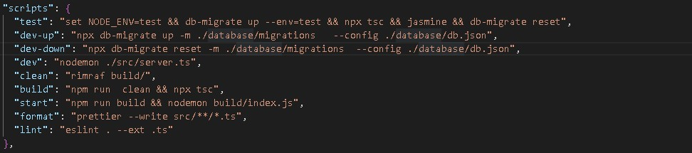

# Storefront Backend Project
This project is a demo for an online store backend. It has all the functionality required to create a backend for the store Like<br>
1- Creating,Reading,Updating and Deleting users, products and orders<br>
2- Authenticating registered users using authentication token.<br>

# Getting Started
**.Env Variables**
YOU MUST ADD THE BELOW VARIABLES IN A `DOTENV`CONFIG FILE


``` 
NODE_ENV='dev'
DB_HOST='localhost'
DB_NAME='shopping'
DB_USER='shopping_user'
DB_PASS='password123'
DB_PORT=5432
DB_NAME_TEST='shopping_test'
BCRYPT_PASSWORD='Pa$$w0rd'
SALT_ROUNDS=10
JWT_SECRET='Pa$$w0rd'
```


**Database structure**
THE DATABASE STRUCTURE CAN BE UNDERSTOOD USING THE FOLLOWING DIAGRAM<BR>


### Development side

## The Scripts Used
here we will begin by showing you the scripts used to run the backend server




# First
open `postgresql` and create a table called **shopping** using this command: <br>
```sql
CREATE TABLE shopping;
```
Then , create a user and give him full privilege on database **shopping** as follows:
```sql
CREATE USER shopping_user PASSWORD 'password123';
```

Then connect to the database using this command:<br>
```
\c shopping
```

Then , Granting privileges as follows:
```sql
GRANT ALL PRIVILEGES ON DATABASE shopping TO shopping_user; 
```
run `npm run dev-up` <br>
This script is used to migrate the database schema and tables to the postgres so that you are ready to run the app.<br>


WHEN YOU OPEN  `POSTGRESQL` and connect to the database `shopping`   

you can start the project by running <br>
run `npm run dev` for the server to start. you will see a message in the console of your vscode that the **server is running at PORT:3000**


### User side
go to the `postman app` and type<br>
```
http://localhost:3000/
```
you will see the Hello World as the default route.

## To Access the (USERS route)
 ```
http://localhost:3000/api/users
```
## if you use a get request you can:
1- Get all users as json object<br>

2- Get one User (if you specify the user id in the parameters `http://localhost:3000/api/users/:id`) **ex:** (localhost:3000/api/users/2)


## if you use the post request you can :
1- Create a new User<br>

2- Authenticate the User (if you specify the email and password in the request body `http://localhost:3000/api/users/authenticate`)


## if you use the patch request you can:
1- Update a User (if you specify the user id in the parameters `http://localhost:3000/api/users/:id`)


## if you use the delete request you can:
1- Delete a User (if you specify the user id in the parameters `http://localhost:3000/api/users/:id`)

The user table has the following coloumns:
```sql
    id SERIAL PRIMARY KEY,
    email VARCHAR(255) UNIQUE,
    user_name VARCHAR(255) NOT NULL,
    first_name VARCHAR(255) NOT NULL,
    last_name VARCHAR(255) NOT NULL,
    password VARCHAR(255) NOT NULL
``` 
you have to pass the above parameters in the **Request.Body** .


# Products Routes 
## if you use a get request you can:
1- Get all products as json object<br>

2- Get one product (if you specify the product id in the parameters `http://localhost:3000/api/products/:id`) **ex:** (localhost:3000/api/products/2)


## if you use the post request you can :
1- Create a new product (http://localhost:3000/api/products/)<br>

## if you use the patch request you can:
1- Update a product (if you specify the user id in the parameters `http://localhost:3000/api/products/:id`)


## if you use the delete request you can:
1- Delete a product (if you specify the user id in the parameters `http://localhost:3000/api/products/:id`)

The product table has the following coloumns:
```sql
     id serial PRIMARY KEY ,
    product_name text,
    product_description text,
    product_price integer
``` 
you have to pass the above parameters in the **Request.Body** .

# Orders
you can **create an order** by going to:
`httP://localhost:3000/api/orders`
choose TYPE POST REQUEST
and in the body of the request you add the id, status and user_id as a json object.


AFTER CREATING THE ORDER YOU CAN ADD PRODUCTS TO IT BY GOING TO :<BR>
`http://localhost:3000/api/orders/products` 


### GET ORDERS

IN ORDER TO GET ORDERS AND VIEW THEM <BR>

YOU USE THE GET REQUEST WITH 
`http://localhost:3000/api/orders/`

# Required Technologies

My API is using the following libraries:

- Postgres for the database
- Node/Express for the application logic
- dotenv from npm for managing environment variables
- db-migrate from npm for migrations
- jsonwebtoken from npm for working with JWTs
- jasmine from npm for testing
- bcrypt for password hashing 


### 3. Models

Created the models for the USERS, PRODUCTS AND ORDERS<br>
for the users > **user.model.ts**<br>
for the products > **product.model.ts** <br>
for the orders > **order.model.ts**

### 4. Express Controllers
Set up multiple controllers for different API functionality <br>


### 5. JWTs

added the validation token to the routes of the api as shown in the pictures.<br>


### Example of usage 


## For further assistance Contact me George @ georgegamil1986@hotmail.com