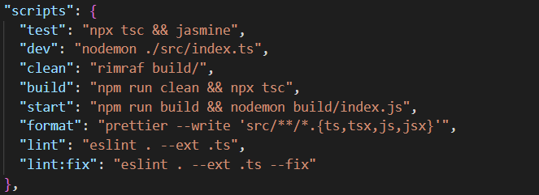
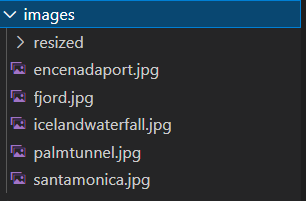

# Image Processing API
<h1 align="center">Hi 👋, I'm George Riad</h1>
<h3 align="center">I am Passionate Full Stack Developer</h3>

- 🔭 I’m currently working on **Image Processing API**

- 🌱 I’m currently learning **nodejs for Backend**

- 👨‍💻 All of my projects are available at [gihub.com/goe86](gihub.com/goe86)

- 📫 How to reach me **georgegamil1986@hotmail.com**

## Description
A simple API using nodejs,express and sharp module to resize an image to any width and height specified.

The API Utilizes the power of the ```sharp``` module, also the File System module and the path Module.

## Installation
Development Modules:
``` bash
    "@types/express": "^4.17.13",
    "@types/jasmine": "^3.10.6",
    "@types/morgan": "^1.9.3",
    "@types/node": "^16.11.41",
    "@types/sharp": "^0.30.4",
    "@types/supertest": "^2.0.12",
    "@typescript-eslint/eslint-plugin": "^5.29.0",
    "@typescript-eslint/parser": "^5.29.0",
    "eslint": "^8.18.0",
    "eslint-config-prettier": "^8.5.0",
    "eslint-plugin-prettier": "^4.0.0",
    "nodemon": "^2.0.16",
    "prettier": "^2.7.1",
    "rimraf": "^3.0.2",
    "ts-node": "^10.8.1",
    "typescript": "^4.7.4"
    ```
Production Modules:
    ``` bash
    "dotenv": "^10.0.0",
    "express": "^4.18.1",
    "jasmine": "^3.99.0",
    "jasmine-spec-reporter": "^7.0.0",
    "m-zanaty-web-utils": "^0.0.19",
    "morgan": "^1.10.0",
    "sharp": "^0.30.6",
    "supertest": "^6.2.3"
```  

# Scripts:



1- ```npm run dev```: This script runs a module called nodemon. the purpose on nodemon is to monitor changes happening to the file specified after nodemon
    ```python
    nodemon src/index.ts
    ``` \n
2- ```npm run build```: This script consists of two commands :\n
    2-a: ```rimraf ./build```: this command deletes the build folder which has the compiled (production version) of the API
    2-b: ```npx tsc```: this command is responsible for compiling the typescript code and have the production version in javascript.
3- ```npm run test```: This script consists of two commands :
    3-a: ```npx tsc```: refer to 2-b
    3-b: ```npm run jasmine```: This command runs jasmine with config specified in the ```reporter.ts``` and ```jasmine.json```
    Jasmine is responsible to conduct API tests to check if all aspects of the API code working as needed.
4- ```npm run format```: This Script utilizes the prettier module of nodejs and is responsible for the quality and looks of your code. it formats your code and rewrites it based on the your configuration in the ```.prettierrc``` file.

# How to use the API
so the previous part was the developer side of the project ... now here we start seeing how you can use the API.

## First
you create a folder called `images` under the root project folder and have all the images you want in here like shown below



then you create a ```resized``` folder inside the ```images``` folder for holding the output of the resize API.

## Second
you start the Server by running the command 
```bash
node build/index.js
```
from terminal inside your project
## Third 
Go to any browser of your choice and type
```http://localhost:3000/api/images?filename=${filename}&width=${width}&height=${height}```

see the example:


where
```filename``` is the name of any of the images in your images folder 
```width``` is the width you want to resize your the width of you image to 
```height``` is the height you want to resize the height of your image to


Thanks 